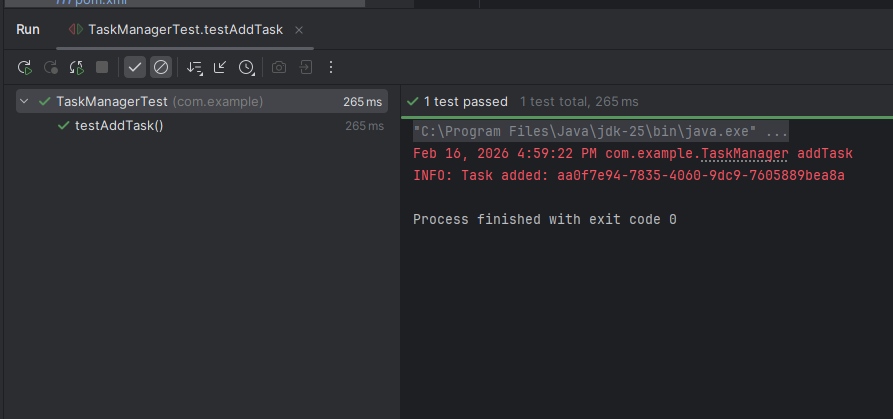
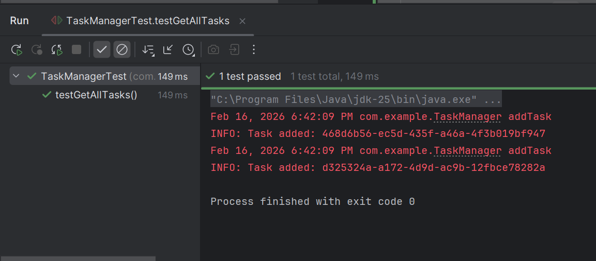
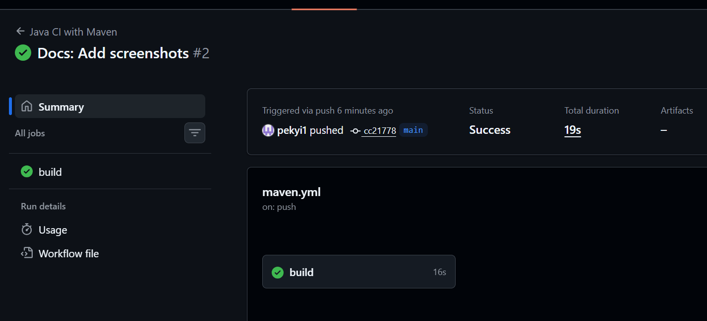

# Sprint 1 Review

**Date:** February 16, 2026
**Sprint Goal:** Deliver working task manager with Create, View, and Complete functionality.

## Deliverables

### 1. Working Software
-   **Create Task:** Implemented. Users can add tasks with title, description, and priority.
-   **View Tasks:** Implemented. Users can see a list of all tasks.
-   **Mark Complete:** Implemented. Users can mark tasks as completed.
-   **Persistence:** Tasks are saved to `tasks.json` and persist across restarts.

### 2. Code Quality & Testing
-   Unit tests created for `Task` and `TaskManager`.
-   Code follows standard Java naming conventions.
-   Project structure follows Maven standard layout.

### 3. CI/CD
-   GitHub Actions pipeline configured in `.github/workflows/maven.yml`.
-   Builds triggered on push to `main`.

## Demo Screenshots
Please place your screenshots in the `screenshots/` folder and name them as follows:
-   `sprint1_add_task.png` -> 
-   `sprint1_view_tasks.png` -> 
-   `sprint1_ci_success.png` -> 

## Status of User Stories
| ID | Story | Status | Points |
|----|-------|--------|--------|
| US-1 | Create Task | **Done** | 3 |
| US-2 | View Tasks | **Done** | 2 |
| US-3 | Mark Complete | **Done** | 2 |
